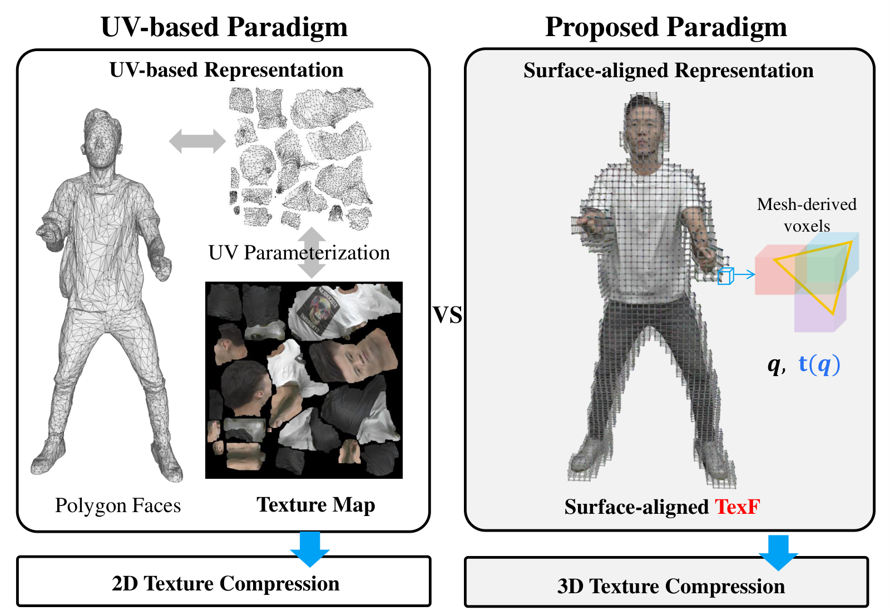
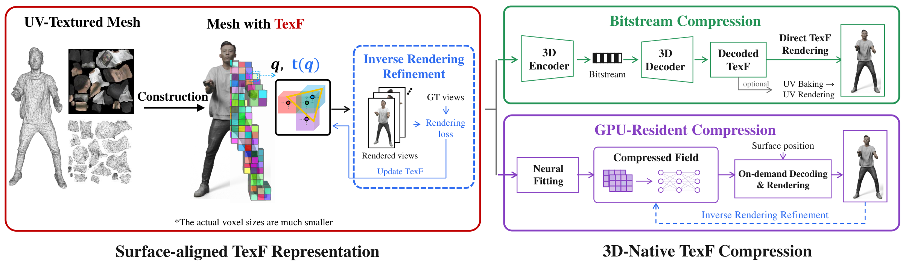
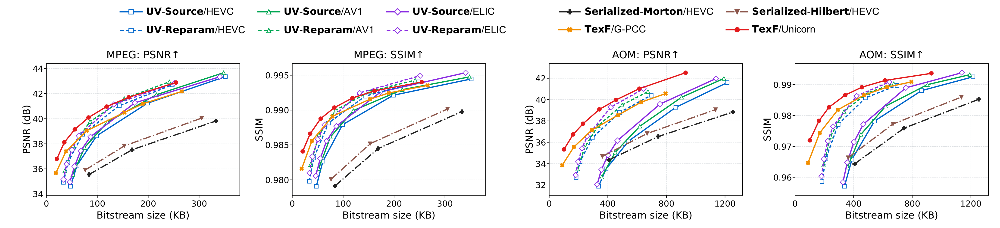
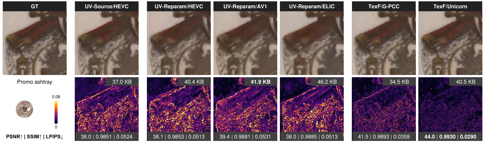
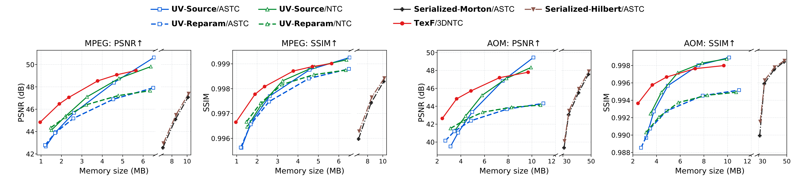
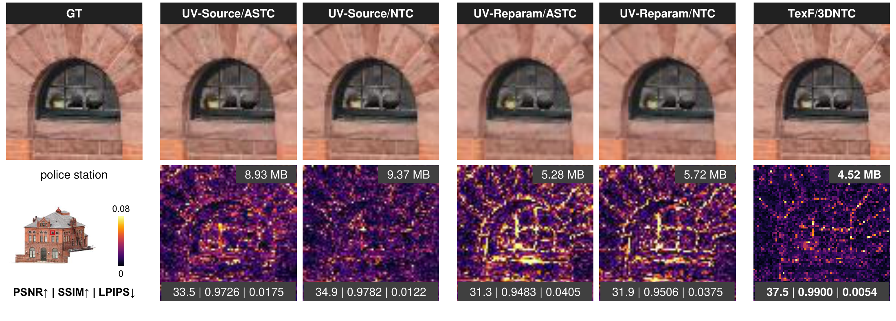

# TexF

## Beyond UV Mapping: Mesh Texture Compression via Surface-Aligned Texture Fields

Jianqiang Wang, Junhui Hou, Siyu Ren, Weiyao Lin, Wenping Wang

City University of Hong Kong · Shanghai Jiao Tong University · Texas A&M University

TexF uses the mesh surface itself to organize and access texture in 3D, rather than mapping it to a separate 2D UV atlas. It supports both compact bitstreams for transmission and GPU-resident compression for real-time rendering.

  

## Overview

TexF is a surface-aligned texture field that organizes texture attributes in sparse voxels derived from the mesh surface. It supports high-resolution textures while preserving local 3D correlations for compression and enabling direct surface queries. Differentiable rendering enables image-space refinement of both voxel attributes and compressed neural fields.

We explore two complementary compression modes:

- **Bitstream compression:** established 3D attribute codecs, including Unicorn and G-PCC, compress TexF attributes. The decoder derives voxel locations from the mesh, avoiding their separate transmission.
- **GPU-resident compression:** 3DNTC combines quantized hash features with a lightweight neural decoder to reconstruct texture on demand during rendering.

## Selected Results

Experiments on the MPEG and AOM benchmarks show improved average rate-distortion performance over representative UV-based methods in both compression settings.

### Bitstream Compression

Average PSNR and SSIM versus bitstream size on MPEG (first two panels) and AOM (last two).

Texture reconstruction at the indicated bitstream sizes. TexF preserves fine details using 3D attribute coding.

### GPU-Resident Compression

Average PSNR and SSIM versus GPU memory size on MPEG (first two panels) and AOM (last two). Horizontal scales differ across the axis breaks.

Texture reconstruction at the indicated GPU memory footprints. TexF/3DNTC combines compact memory use with random-access decoding.

## Updates

Code will be released.

For questions, contact [wang.jq@cityu.edu.hk](mailto:wang.jq@cityu.edu.hk).
